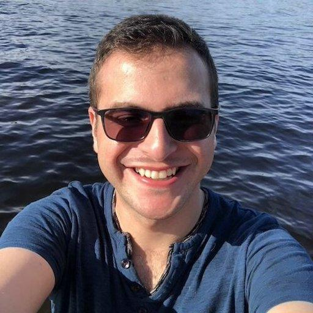

  
 │<h1>DOUGLAS MENDES BARRETO</h1>
  <h3>Senior Software Engineer Manger</h3>
  

    +1 (581) 748 0657 • mendes-barreto@live.com • <a href="https://www.linkedin.com/in/mendesbarreto">in/mendesbarreto</a> • Gatineau, QC - Canada
  

## Professional Summary

With 14 years in software engineering, I’ve worked across the full stack, leading and mentoring teams that ship quality products. My focus is on delivering what clients actually need by collaborating closely with product and design and ruthlessly trimming down processes. This means practical agile, a strong focus on automation, and a culture of high quality.

I stay hands-on by architecting systems, managing migrations, and consulting. This keeps my skills sharp and helps me understand my team's challenges.

My goal is simple: build high-performing teams and scalable solutions that actually work.

---

## Management Skills

- Expert in Scrum and Kanban methodologies, fostering collaborative and high-performing teams.
- Proven track record of mentoring engineers, leading technical teams, and developing talent from junior to senior levels.
- Experienced in collaborating with product managers, designers, and cross-functional teams to deliver robust solutions.
- Led client engagements and delivered solutions across multiple organizations as a technical consultant.
- Successfully managed complex migration projects, full game development lifecycles, and multi-client deliverables.
- Established development processes using JIRA/Github Projects, implemented CI/CD pipelines, and promoted TDD/BDD practices across teams.
- Skilled in managing client relationships, defining requirements, and aligning technical solutions with business objectives.
- Delivered technical talks and presentations to engineering teams on best practices in coding, testing, and QA implementation.

## Tech Skills

- Technology Polyglot Knowledgeable in a wide range of programming languages and frameworks, including Python, JavaScript/TypeScript, Go, C++, C#, Ruby, Swift, Objective-C, and ++.
- GraphQL, Restful APIs, Microservices Architecture, Event-Driven Systems.
- Node JS, Next.js, React Native, Native iOS/Android Development.
- Docker, Kubernetes, CI/CD Pipelines (Jenkins, GitHub Actions).
- MySQL, PostgreSQL, MongoDB, Redis.
- Automation, Testing (Unit, Integration, E2E), TDD/BDD.
- Design Patterns, SOLID Principles, Agile Methodologies (Scrum, Kanban).

---

## Professional Experience

**Senior Software Engineering Manager**

Xpertsea - Predictive shrimp biomass control with AI delivering sustainable aquaculture solutions

51 - 100 employees

Quebec, Canada

2020-10 – Present

- Led a 9-engineer team in the development and scaling of complex applications.
- Spearheaded a full-stack migration from AWS to Google Cloud, achieving an **20%** reduction in infrastructure costs.
- Led and directly contributed to a full platform re-architecture, improving developer experience (DX) and user engagement (UX) to successfully drive the company to product-market fit.
- Introduced trunk-based development to the team, reducing gitflow overhead and significantly improving feature lead time.
- Pioneered a new 1:1 methodology that leveraged AI-powered summaries to create a searchable, data-driven history of discussions, goals, and team progress.
- Led and directly contributed to the re-architecture of all CI/CD pipelines (frontend, backend, testing), cutting total build and deploy time from 50 minutes to **7 minutes**.
- Increased team productivity by **550%** by optimizing development processes, cutting the average feature lead time from 13 weeks to 2 weeks.
- Boosted team efficiency by implementing Kanban, leading to a **20%** reduction in planning time and a more simplified, continuous development flow.
- Designed and implemented a collaborative workflow to bridge the gap between engineering and product, which minimized communication friction and cut down on unnecessary meetings.
- Oversaw the successful launch of 6 major projects.
- Introduced new engineering standards that improved code quality, reduced bug rates by **23%**, and streamlined team async communication.
- Managed all people functions, including performance reviews, mentorship, and conflict resolution.
- Actively participated in development cycles, contributing code to backend services (Python, JS/TypeScript) and frontend Next.js applications to accelerate key initiatives.
- Architected and built a cross-platform Computer Vision framework in C++ to unify high-performance image and video processing for native iOS and Android.

---

**Senior iOS Developer**

Social.mom - Social Media for mothers focused on delivering a safe and supportive environment

11 - 20 employees

Oct 2019 – Oct 2020

- Engineered and maintained a high-traffic iOS application, driving the migration of key features from Objective-C to Swift.
- Led a major re-architecture of the native codebase, cutting maintenance overhead and new feature development time by **20%**.
- Authored automation scripts that eliminated hundreds of hours of manual, repetitive tasks for the development team.
- Established a formal testing culture by introducing end-to-end (E2E) and unit testing, significantly improving application reliability.
- Mentored engineers on software design, promoting the adoption of SOLID principles and modern design patterns.

---
**Senior Software Engineer**

Levio - Tech Consulting

1K - 5K employees

Jul 2018 - 2019 Oct

- Engineered and maintained scalable, high-availability backend services for multiple clients using .NET C#.
- Executed complex legacy modernization projects, successfully migrating critical client systems from COBOL to modern .NET platforms.
- Led a project to migrate customers from legacy version control systems to Git, modernizing their source code management practices.
- Acted as a key technical consultant, collaborating with cross-functional teams to define requirements and deliver robust solutions.
- Contributed to the optimization and automation of continuous integration (CI) pipelines to improve build and deployment efficiency.

---
**Senior Mobile Engineer**

Concrete Solutions - Tech Consulting

10K+ - employees

Jul 2015 – Aug 2018

- Progressed from Developer to Senior Engineer, leading the architecture and development of native mobile applications for multiple clients.
- Developed 3 mobile banking applications and 4 e-commerce apps, delivering high-quality financial and retail solutions.
- Architected and developed a "white-label" e-commerce mobile platform, enabling the rapid deployment of customized storefronts from a single codebase.
- Delivered multiple technical talks to engineering teams on best practices in coding, testing, and QA implementation.
- Designed and implemented robust CI/CD pipelines (Jenkins, Bitrise, TravisCI) and promoted TDD/BDD practices (XCTest, Kif).

---
**Lead Game Programmer**

Editora Globo - Publisher and developer of digital entertainment products

500 - 1k employees

Aug 2010 – Apr 2015

- Progressed from Game Programmer to Lead, managing the full game development lifecycle, product concepting, and team leadership.
- Led the end-to-end development of cross-platform games (iOS, Android, Windows) using C# and Unity3D.
- Architected and built critical backend services for MMO games, including login systems and room controllers, using SmartFoxServer (Java/MySQL).
- Designed and developed a reusable Unity3D framework and custom engine tools, significantly increasing team productivity.
- Implemented JIRA to establish and manage the team's development process.

---
**Junior Analyst Programmer**

People Way - Tech Consulting

11 - 50 employees

Apr 2009 – Feb 2010

- Developed and maintained enterprise web applications using the J2EE stack (JSP, JSF) and SOAP web services.
- Managed the client data lifecycle, including database design (MySQL) and building custom reports with JasperReport.
- Engineered data parsing scripts to process and manipulate diverse formats (SMS, XML, CSV).

---

## Education

**Universidade Anhembi Morumbi**

Bachelor Degree in Game Design and Development - 2010

## Languages

- Portuguese: Native
- English: Fluent
- French: Professional Working Proficiency
